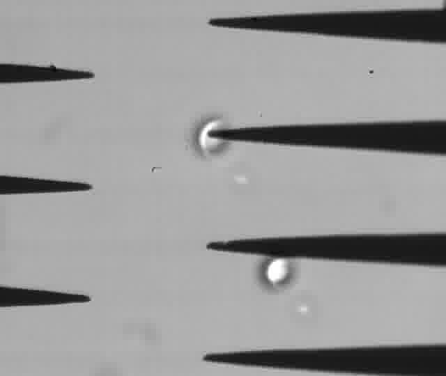

# Tracking beads
## Tutorial to track the position of beads with difficult background

Tracking beads is a task that is often used in miniature systems, since the position and movement of beads can be used to extract information about them and their environment. Beads can de used to detect the flow of liquid, its viscosity and to measure the forces acting on the particles. A clean and uniform background makes it easier to track beads, however this is not always the case. Tracking of multiple beads is also easier when the beads are similar, but even monodisperse beads can appear different during image analisys when there is motion blur, when the beads move in and out of focus, when the lightining of the image is not uniform and when the beads are too close to each other.

This software was developed to track fast moving polysterene beads observed by brightfield against a patterned opaque background. For example:

  

_Polysterene beads have distinct moves in liquid paraffin containing surfactant span 80 when an electric field is applied. The motion patterns depend on the voltage and surfactant concentration._

The main part of the code was provided by  [this Stack overflow answer.](https://stackoverflow.com/questions/26932891/detect-touching-overlapping-circles-ellipses-with-opencv-and-python)

This tutorial was tested in Ubuntu LTS 16.04.6 using Python 3.5.2. The steps can be adapted to use different OS and software.

From the video to the position of beads in Linux.

### 1. **Convert the video to a series of images**

The software we are going to use is only able to analyze still images, so we need to convert it to a series of images. 

For this, you can use the ffmpeg software and the command on terminal:

`ffmpeg -i infile.avi -f image2 image-%03d.jpg`

where infile.avi is the name of your video and image-03%.jpg is the name format of the series out images generated.

### 2. **Make an average image**

A way to detect a moving object is to generate a background image and then subtract each frame from the image being analyzed. 

For this, use the **average.py** contained in this project.

This will produce an image where the objects in motion will appear blurred. 

  

_Average image of 500 frames shows traces of the moving objects on the still background._

### 3. **Erase the ghost trajectories from the average image**

In an ideal average image, we obtain a clear background that can be subtracted to identify the moving subject. However, when the subject moving slowly, not moving, or moving repeatedly over the same area, we observe ghost traces. Ghost traces can trick the image analisys software.

To solve that, we have to manually clean the background image using image software. Here, we used the ipad Photoshop Fix app with the healing tool to erase the ghost traces. For example:

  

### 3. **Set parameters for bead identification**

We are trying to identify particles that don't have a traditional appearence, so it can be difficult for the software to identify the bead features. To solve that, parameter of the particles such as size and eccentricity are passed down to the software **set_parameters.py** and the parameters have to be manually tested. 

  

_Original image. In this image, the beads are out of focus. The bright regions are not uniform and are superimposed with the sawtooth electrodes. For simple tracking algorithms, it would be challenging to identify the position of these beads._

  

_The image treatment outputs an image which, ideally, is composed of a black background with bright spots marking the position of the particles._

  

_The software correctly identified the position of the beads, even though the shape of the bright spots did not correspond to the spherical shape of the particles._

#### Overview of the detection algorithm and parameters

The parameters that have to be chosen manually are:

- ellipse_morph_x: used in case the particles are not spherical 
- ellipse_morph_y: used in case the particles are not spherical 
- radius: expected average radius of particles in pixels
- border_size: expected border of particles
- gap: minimum distance between particles
- threshold_binary: value for a threshold filter
- power_filter: the value of every pixel in an image becomes value^power_filter
- brighten_factor: the value of all pixels in am image becomes value x brighten_factor

The main part of the algorithm was obtained from [this Stack overflow answer](https://stackoverflow.com/questions/26932891/detect-touching-overlapping-circles-ellipses-with-opencv-and-python) with some additional steps. First, the background image produced on steps 2 and 3 is subtracted from the frame being analyzed. Then, the following steps are performed. Please refer to the links for a more detailed explanation.

- [Power transformation](https://www.tutorialspoint.com/dip/gray_level_transformations.htm): the _value_ of each pixel of the image becomes _value^power_filter_. This brightens the brighter pixels and darkens the dimmer pixels. 
- [Filter regional maxima](http://scikit-image.org/docs/dev/auto_examples/color_exposure/plot_regional_maxima.html#sphx-glr-auto-examples-color-exposure-plot-regional-maxima-py): the less bright areas of the images are used as a mask, that way, the brighter regions appear to be on a black background.
- [Linear transformation](https://www.tutorialspoint.com/dip/gray_level_transformations.htm): the _value_ of each pixel of the image becomes _value x brighten_factor_.

From here on, the algorithm from Stack overflow is applied without modifications:

- [Morphological closing](https://opencv-python-tutroals.readthedocs.io/en/latest/py_tutorials/py_imgproc/py_morphological_ops/py_morphological_ops.html): this is the combination of teo transformations: dilation and closing. With dillation, the area of the bright regions is expanded. This will cause dark spots to diminish. Then, the edges of the new bright areas are again retracted. The result is a more uniform image and defects in the foreground images diminish.
- [Template matching](https://www.geeksforgeeks.org/template-matching-using-opencv-in-python/): in this step, an image resembling a bead after the morphological closing is created based on the parameters _ellipse_morph_x,  ellipse_morph_y, radius_ and the template is matched to the image after the morphological closing. The matching will produce an image where the templates are superimposed to the regions that match the bead template. 
- [Distance transform](https://www.tutorialspoint.com/opencv/opencv_distance_transformation.htm): a distance transform is taken from the image generated from the template matching. In this image, the center of the regions that matched the template of a bead appear brighter. Then, the image from the morphological closing and the distance transform are multiplied. The result is an image with more or less uniform bright spots.
- [Threshold](https://docs.opencv.org/3.4/d7/d4d/tutorial_py_thresholding.html): finally, a threshold is applied to the image. The result are white spots against a black background. if the parameters were set correctly, the center of these spots coincide with the position of the beads, even if they were blurry on the original image. To detect the center of these bright spots, there is function to locate the local maxima.  

